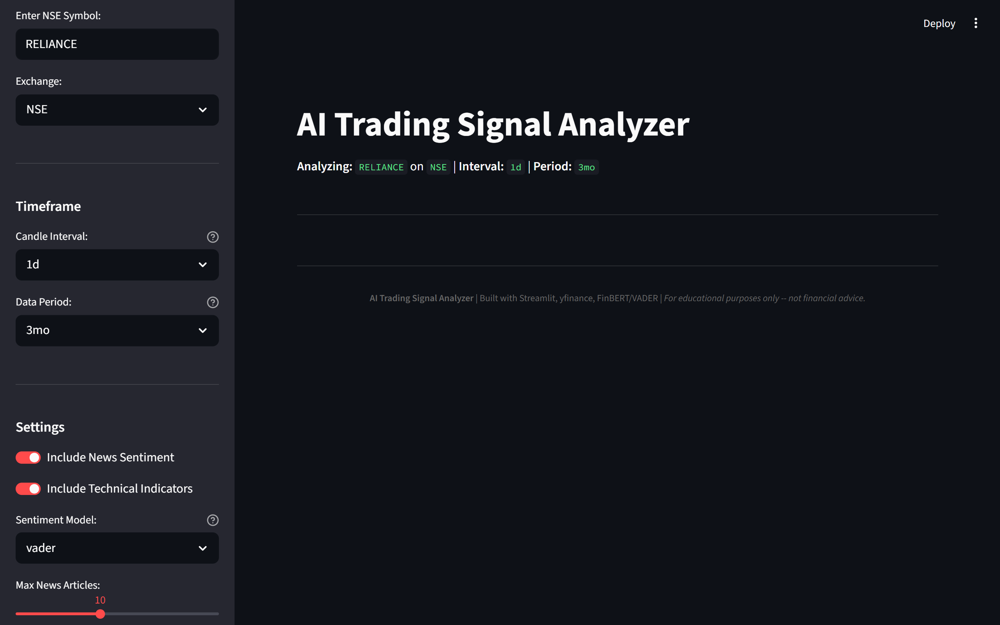
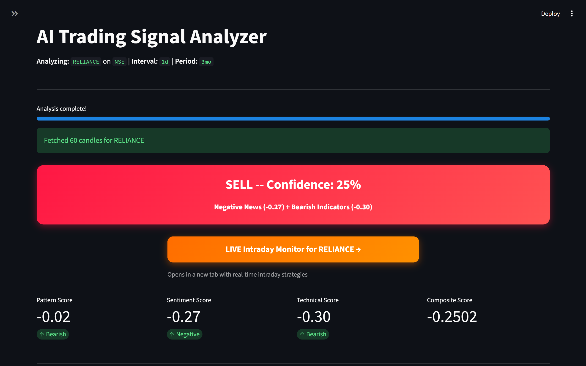
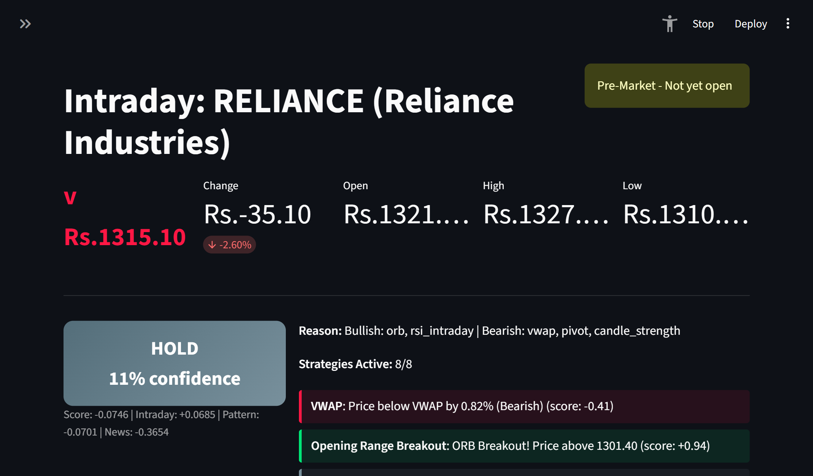
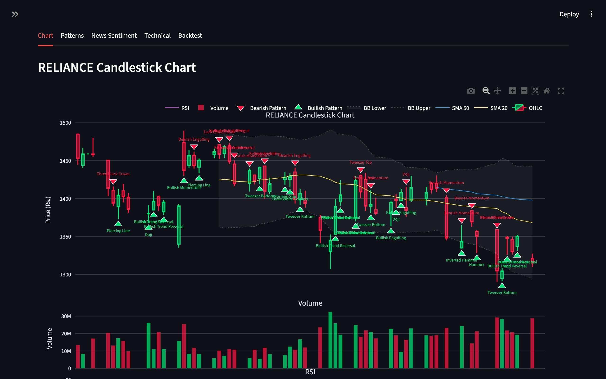
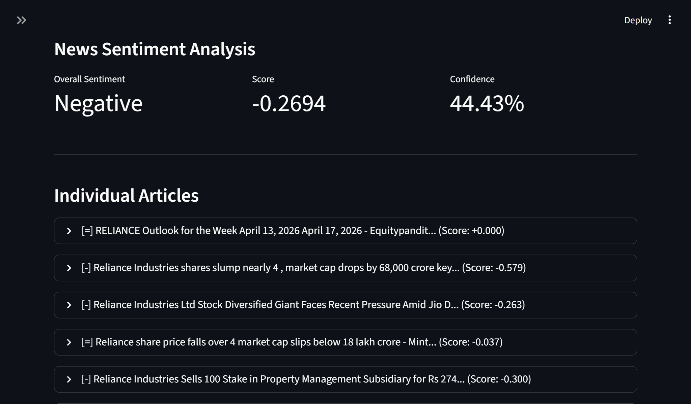
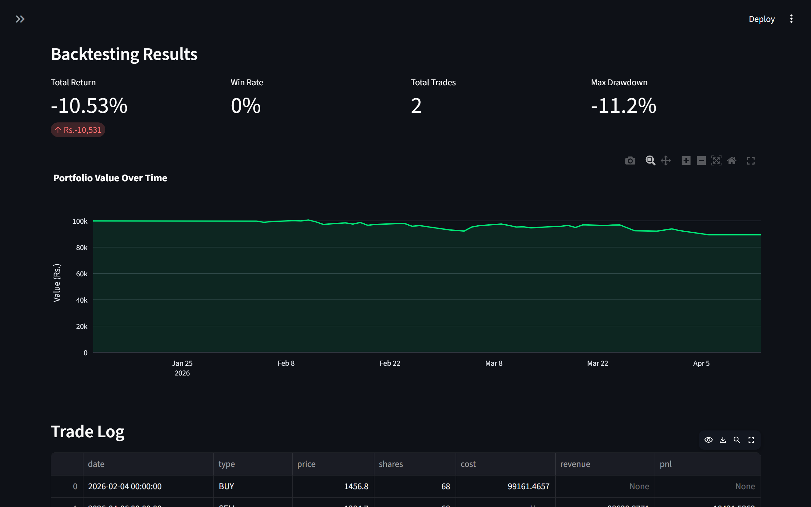

Set-Content -Path README.md -Value @'
# 📈 AI Trading Signal Analyzer

An AI/ML-powered stock trading signal analyzer that combines **candlestick pattern recognition**, **real-time news sentiment analysis**, and **technical indicators** to generate BUY/SELL/HOLD signals for Indian NSE/BSE stocks — with a **live intraday monitoring dashboard**.

🌐 **Live Demo:** [trading-signal-analyzer.streamlit.app](https://trading-signal-analyzer.streamlit.app)

---

## 📸 Screenshots

| Main Analysis | Signal Output | Intraday Live |
|:---:|:---:|:---:|
|  |  |  |
| Select stock, timeframe & analyze | BUY/SELL/HOLD with confidence % | Real-time monitoring with 8 strategies |

| Candlestick Chart | News Sentiment | Backtesting |
|:---:|:---:|:---:|
|  |  |  |
| Interactive chart with pattern markers | Article-level sentiment scoring | Simulated P&L with trade log |

---

## ✨ Features

### 📊 Main Analysis Mode
- **21 Candlestick Patterns**
- **Volume Confirmation**
- **8 Technical Indicators**
- **News Sentiment Analysis**
- **Dual Sentiment Engine** — VADER + FinBERT
- **Rule-Based Decision Engine**
- **ML Decision Engine**
- **Backtesting**

### 🔴 Live Intraday Mode
- **Auto-Refresh**
- **8 Intraday Strategies**
- **Market Hours Awareness**
- **Live Price Banner**
- **Signal History**
- **Direct Link from Main Page**

### 🏢 Indian Market Support
- **15+ Popular NSE Stocks**
- **Custom Symbol Entry**
- **NSE/BSE Exchange Toggle**
- **Indian News Sources**

---

## 🏗️ Architecture
<Architecture diagrams omitted for brevity; same as previous snippet>

---

## 🧱 Tech Stack

<Tech stack table omitted for brevity; same as previous snippet>

---

## 📁 Project Structure

<Project structure omitted for brevity; same as previous snippet>

---

## 📊 How It Works

<Pipeline diagram and steps omitted for brevity; same as previous snippet>

---

### Intraday Strategies

<Intraday strategies table omitted for brevity; same as previous snippet>

### Pattern Detection (21 Patterns)

<Pattern detection table omitted for brevity; same as previous snippet>

---

## 🚀 Local Setup

### Prerequisites

| Requirement | Version | Check |
|:---|:---|:---|
| Python | 3.9 - 3.13 | `python --version` |
| pip | latest | `pip --version` |
| Git | any | `git --version` |
| RAM | 4GB+ (8GB for FinBERT) | - |

### 1. Clone & Install

\`\`\`bash
git clone https://github.com/TanmaySharma977/trading-signal-analyzer.git
cd trading-signal-analyzer

# Create virtual environment
python -m venv venv

# Activate
# Windows:
venv\Scripts\activate
# Mac/Linux:
source venv/bin/activate

# Install dependencies
pip install --upgrade pip
pip install -r requirements.txt

# Download NLTK data
python -c "import nltk; nltk.download('vader_lexicon'); nltk.download('punkt')"
\`\`\`

### 2. Configure Environment (Optional)

\`\`\`bash
# Copy the example environment file
cp .env.example .env

# Edit the .env file to optionally include your NewsAPI key
# Add the following line:
NEWS_API_KEY=your_newsapi_key_here

# Note: The app works without any API keys. Google News RSS is the default and requires no key.
\`\`\`

### 3. Run the Main App

\`\`\`bash
# Run the main analysis dashboard
streamlit run app/main.py

# After running, open in your browser:
http://localhost:8501
\`\`\`

### 4. Run Intraday Mode

\`\`\`bash
# Navigate via sidebar or open directly:
http://localhost:8501/Intraday_Live?stock=RELIANCE&exchange=NSE
\`\`\`

### 5. Run Tests

\`\`\`bash
# Run integration tests
python tests/test_quick.py
\`\`\`

---

## ⚠️ Disclaimer
This project is for educational purposes only. It is NOT financial advice. Consult a certified advisor before investing.

---

👨‍💻 Author  
Tanmay Sharma  
GitHub: github.com/TanmaySharma977  
Email: tanmaysharma977@gmail.com  

📄 License: MIT  

🙏 Acknowledgments  
Yahoo Finance, VADER, FinBERT, Plotly, Streamlit, MoneyControl, Economic Times
'@